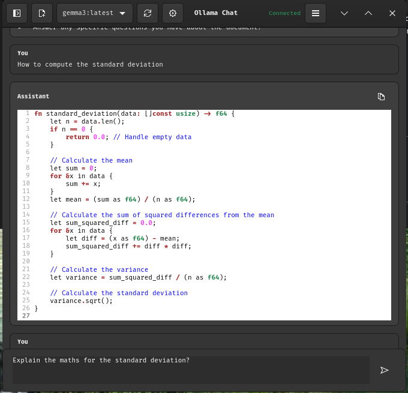

# Ollama Chat

A simple and lightweight GTK4 chat application for interacting with local Ollama AI models.



## Features

*   **Chat with Local Models:** Connect to a running Ollama instance and chat
    with any of your downloaded models.
*   **Model Selection:** Easily switch between available models from a dropdown
    menu.
*   **Chat History:** Your conversations are automatically saved and can be
    accessed from the history panel.
*   **Context from Files and URLs:** Include the content of local files or web
    pages in your prompt.
*   **Markdown Rendering:** Assistant responses are rendered with basic
    Markdown for improved readability, including syntax-highlighted code
    blocks.
*   **Configurable:** A user-editable configuration file
    (`~/.config/ollama-chat/config.json`) stores your settings.
*   **Customizable Model Parameters:** Adjust model parameters like
    temperature, top-p, and system prompt through the Preferences dialog.
*   **Cross-Platform:** Built with GTK4 and a Meson build system for
    portability across Linux, macOS, and Windows.

## Using External Context

You can provide external context to the model directly from the chat input:

*   **From a URL:** Simply paste a URL into the text box. The application will
    fetch the content of the web page and include it in the prompt.
*   **From a File:** Type `@` followed by the path to a local file (e.g.,
    `@/path/to/your/file.txt`). The application will read the file's content
    and include it in the prompt. If the file is binary, its content will be
    excluded.

## Preferences

The Preferences dialog allows you to customize the behavior of the Ollama
model:

*   **Temperature:** Controls the randomness of the model's output. Higher
    values (e.g., 1.2) produce more creative responses, while lower values
    (e.g., 0.5) are more deterministic.
*   **Top P:** Sets a threshold for nucleus sampling. The model will only
    consider the most likely tokens with a cumulative probability of `top_p`.
*   **Top K:** Limits the model's choices to the `top_k` most likely tokens.
*   **Seed:** A number used to initialize the model's random number generator.
    Setting a seed ensures that you get the same response for the same prompt
    every time. A value of 0 means the seed is random.
*   **Context Length:** The maximum number of tokens to keep in the
    conversation history.
*   **System Prompt:** A custom instruction that is always prepended to the
    conversation history, allowing you to guide the model's behavior.

## Keyboard Shortcuts

| Shortcut      | Action               |
|---------------|----------------------|
| `Ctrl+N`      | New Chat             |
| `Ctrl+R`      | Refresh Models       |
| `Ctrl+,`      | Open Preferences     |
| `Ctrl+H`      | Toggle History Panel |
| `Ctrl+Q`      | Quit Application     |

## Dependencies

To build and run Ollama Chat, you will need the following libraries:

*   GTK4
*   libcurl
*   json-c
*   GtkSourceView 5
*   libuuid

### Linux (Debian/Ubuntu)

On a Debian-based system (like Ubuntu), you can install these with:

```bash
sudo apt install libgtk-4-dev libcurl4-openssl-dev libjson-c-dev libgtksourceview-5-dev uuid-dev
```

You will also need the **Meson** build system and **Ninja**:

```bash
sudo apt install meson ninja-build
```

### macOS (Homebrew)

On macOS, you can install these dependencies using [Homebrew](httpshttps://brew.sh/):

```bash
brew install pkgconf gtk4 json-c gtksourceview5 meson ninja ossp-uuid
```

## Building and Running

1.  **Clone the repository:**
    ```bash
    git clone https://github.com/data-inquiry/ollama-chat.git
    cd ollama-chat
    ```

2.  **Set up the build directory:**
    ```bash
    meson setup builddir
    ```

3.  **Compile the application:**
    ```bash
    meson compile -C builddir
    ```

4.  **Run the application:**
    ```bash
    ./builddir/ollama-chat
    ```

## Installation

To install the application system-wide (including the `.desktop` file and icon), run:
```bash
sudo meson install -C builddir
```

After installation, you should find "Ollama Chat" in your application menu.

## Configuration

The application stores its configuration in `~/.config/ollama-chat/config.json`. This file is created automatically on the first run and can be edited manually. You can also change most settings through the in-app Preferences dialog.

Here is an example of the configuration file:
```json
{
  "selected_model": "llama2",
  "window_width": 1200,
  "window_height": 800,
  "pane_position": 250,
  "history_panel_visible": true,
  "ollama_context_size": 4096,
  "theme": "light",
  "web_search_enabled": true,
  "temperature": 0.8,
  "top_p": 0.9,
  "top_k": 40,
  "seed": 0,
  "system_prompt": "You are a helpful assistant."
}
```

## License

This project is licensed under the MIT License. See the `LICENSE` file for details.
